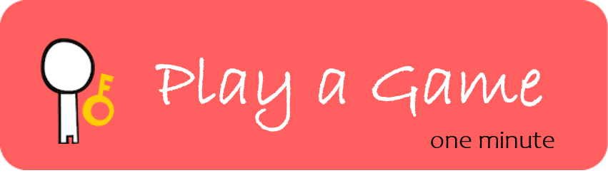

<h1 style="font-size: 2.5rem; margin: 0;">👋 Hey, I'm Leon Kay!</h1>

*A passionate .NET engineer exploring Web3 innovation while balancing technical excellence with life*

## 🚀 About Me

- **Tech Background**: .NET engineer focused on clean code and innovative solutions
- **Web3 Believer**: Convicted that decentralization is redefining the internet's underlying logic
- **Life Philosophy**: Pursue technical excellence while maintaining work-life balance

## 💻 What I'm Working On Now
- [ ] 🦀 Learning Rust programming language
- [ ] ⛓️ Researching Solana on-chain development
- [ ] 🔧 Diving deep into Web3 tech stack
- [ ] 📚 Exploring blockchain fundamentals
- [ ] 🛠️ Building decentralized applications (dApps)

## 🎯 Technical Interests
- **Core Skills**: .NET ecosystem development
- **Exploration Areas**: Web3, blockchain, smart contracts
- **Learning Focus**: Rust, Solana, DeFi protocols

## 🌱 Hobbies
- 📖 Reading philosophy, history & literature
- ⚽ Ball sports enthusiast
- 🚴 Urban cycling explorer
- 🏍️ Motorcycle riding

## 💡 My Philosophy
> In this rapidly changing era, decentralization brings opportunities for freedom and innovation, allowing every voice to be heard. As an engineer, I'm committed to driving business success through technology while staying sharp to new trends.

---

## 🛠️ Tech Stack

  
  
  
  
  
  
  
  
  
  
  
  
  
  
  

---

## 📫 Let’s Connect!

### 💝 Support My Work

------

### 🎮 Fun Zone

*🎁 A special thank you gift awaits those who support my work!*

------
**© 2024 Leon Kay • Made with ❤️ and lots of ☕**

